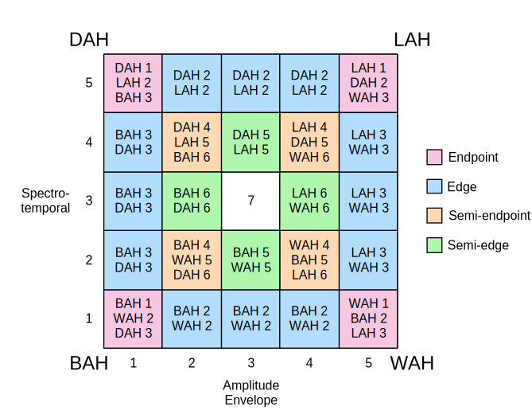

## Poster

I presented [this poster](docs/ASA_cue_profile.pdf) of my efforts to shorten the cue profile at the ASA in Seattle 2021.

## Additional Notes

### Operationalizing accuracy of ambiguous stimulus/response pairs

Because there isn't a true sense of accuracy for the synthesized continnua of spectrotemporal and amplitude envelope variation, we develop a notion of "grid accuracy," which captures the gradient ability of the listener to attend to salient cues.  The schematic above shows how accuracy is calculated in seven dimensions for a listener.

The accuraccy vector begins as a 7-dimensional zero vector:
 
[ 0 0 0 0 0 0 0 ]

Each trial consists of a stimulus and response.  To increment the accuracy vector, we locate the position of the stimulus on the grid.  If the text for that cell contains a (response, n) pair corresponding to the given response, the nth dimension of the vector is incremented by one.

For example, supposse at trial t=1 a listener is given the stimulus at (2,5).  Spectrotemporally, this is considered strongly alveolar.  However, the rise time of this token is more ambiguous.  It is therefore reasonable that a listener could respond with either "DAH" or "LAH" to this cue, showing that they attend well to the spectral cue but aren't being provided clear temporal disambiguation.  Outer spectral attention is recorded in the second dimension of the accuracy vector, so when we account for this first trial the accuracy becomes 

[ 0 1 0 0 0 0 0 ] 

if the subject responded with "DAH" or "BAH," and otherwise remains unchanged.

### Misc

This project is very much ongoing!  Please email me directly for access to code or to discuss.
